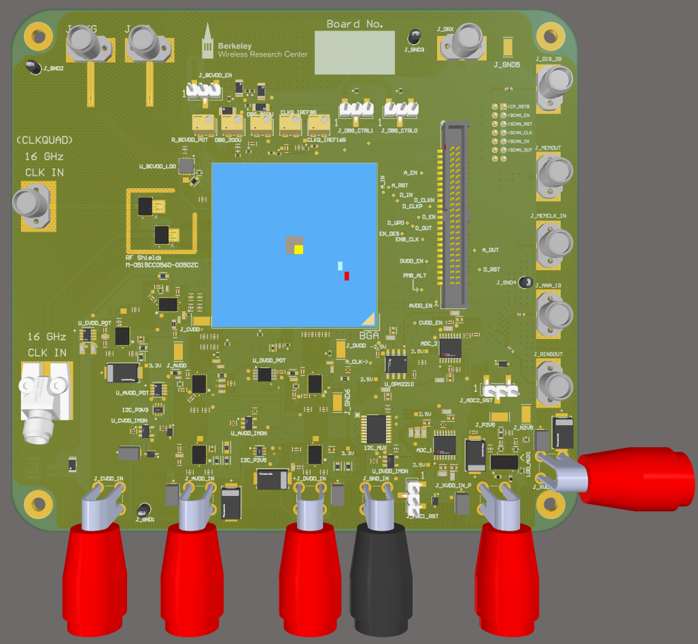
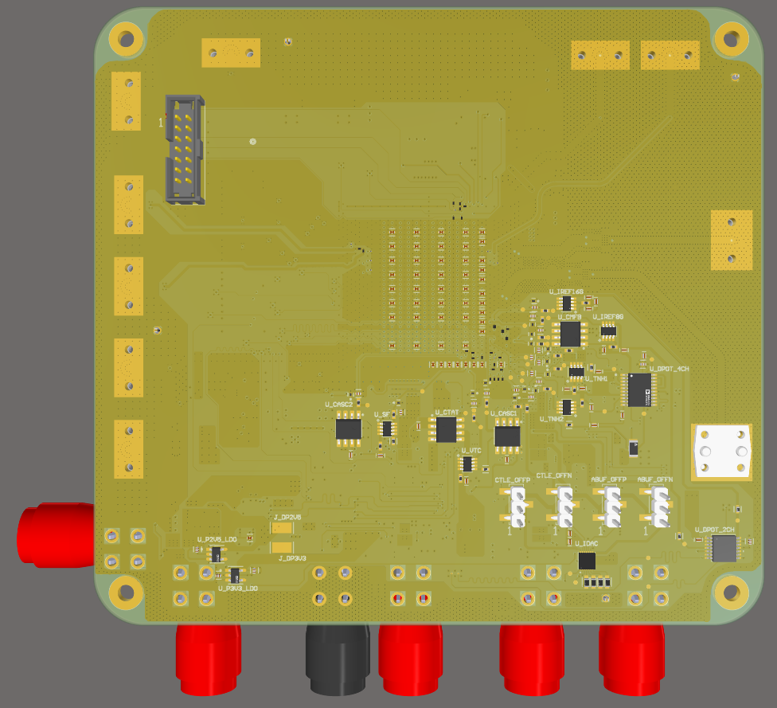

# PCB for ADC-Based 128 GBaud/s SerDes Receiver
This repository contains the PCB design files for the ADC-based 128 Gbaud/s SerDes Rx project.
The project, named "PDMLSE", refers to a DSP-assisted non-linear equalizer implemented in the Intel16 chip (Q4 2024 Shuttle). 

For more details about the designs and layout, please refer to the [TestPlan.pdf](https://github.com/kunmok/pcb-for-128GSPS-adc-based-serdes/blob/main/docs/TestPlan.pdf), [Fabrication Drawing](https://github.com/kunmok/pcb-for-128GSPS-adc-based-serdes/blob/main/docs/fabrication%20drawing%20with%20blindvia.PDF), [pdmlse_pcb.pdf](https://github.com/kunmok/pcb-for-128GSPS-adc-based-serdes/blob/main/docs/pdmlse_pcb.pdf), or contact Kunmo (kunmok@berkeley.edu). 

PCB front-side 

PCB back-side 

