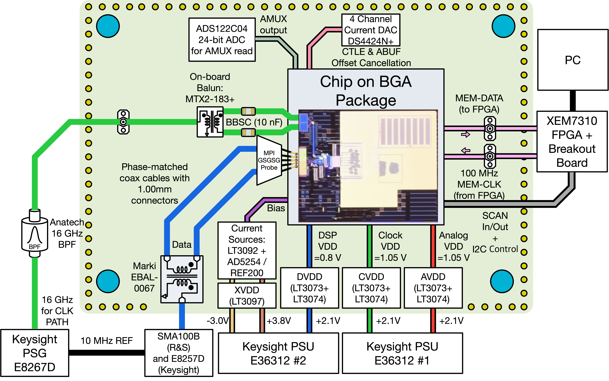
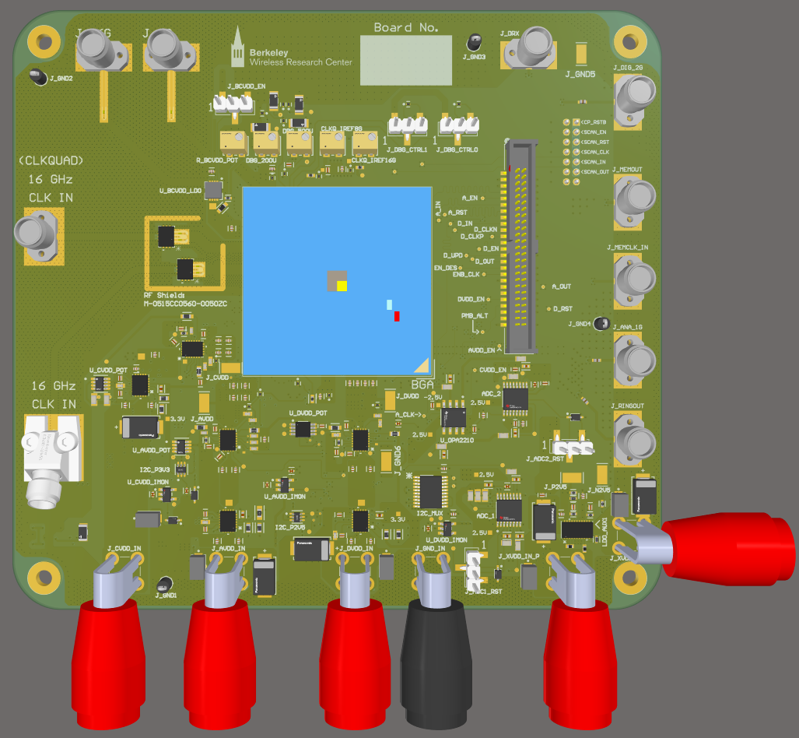
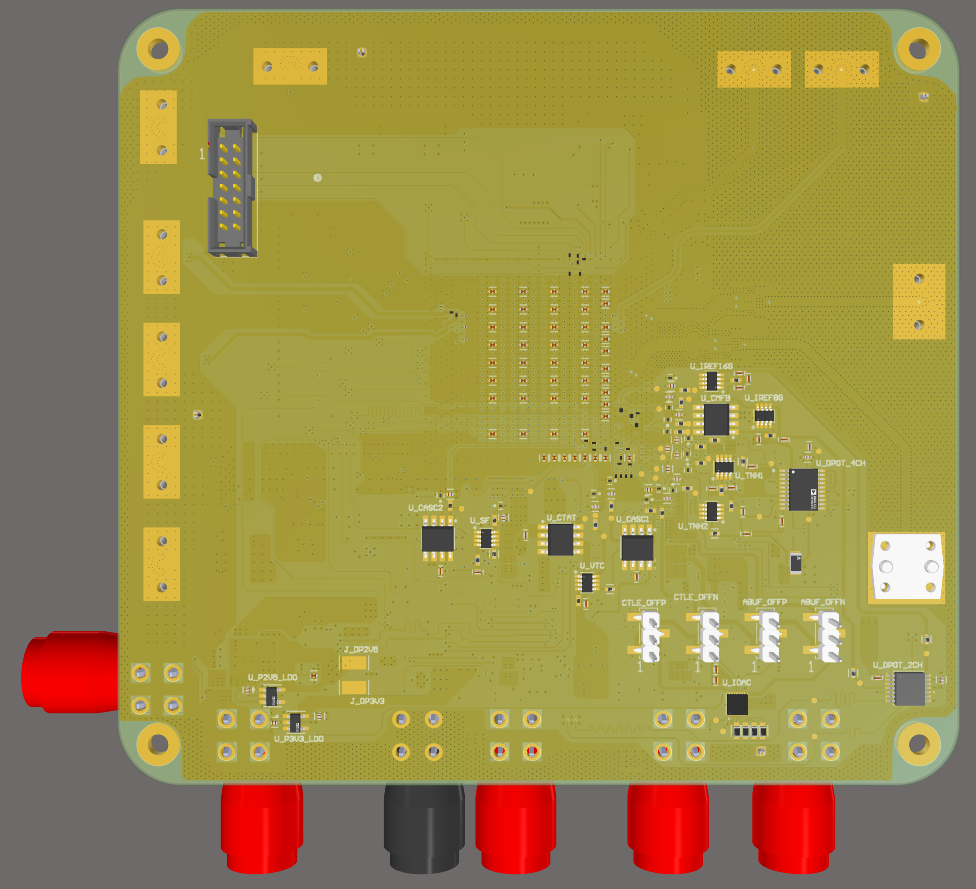
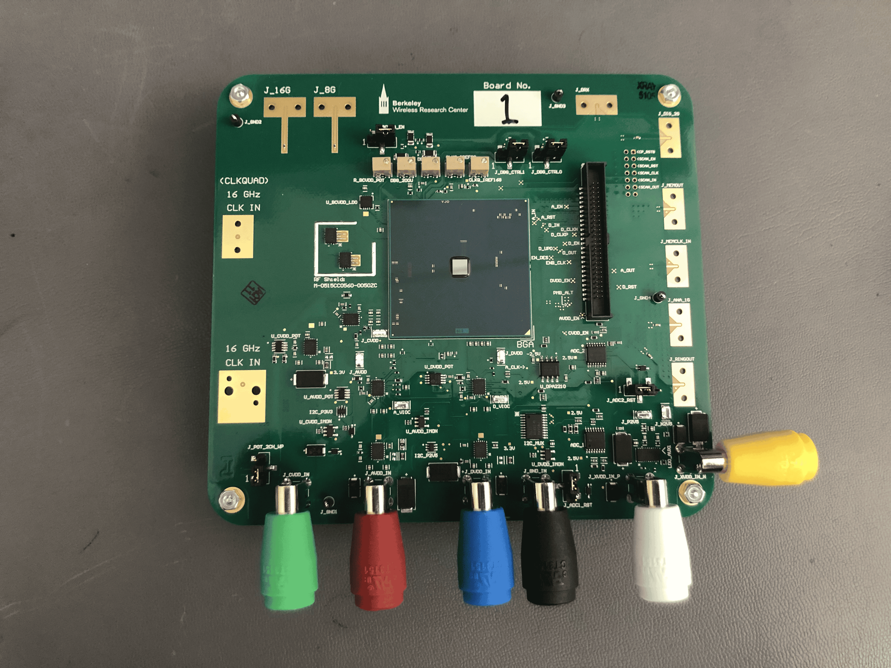
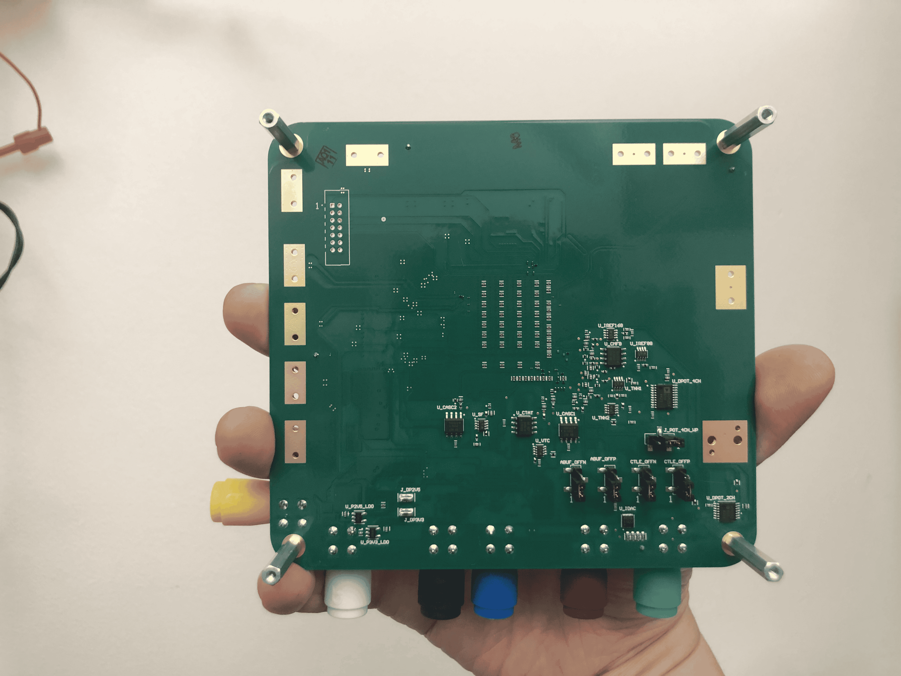

# PCB for ADC-Based 128 GBaud/s SerDes Receiver
This repository contains the PCB design files for the ADC-based 128 Gbaud/s SerDes Rx project.
The project, named "PDMLSE", refers to a DSP-assisted non-linear equalizer implemented in the Intel16 chip (Q4 2024 Shuttle). 

For more details about the designs and layout, please refer to the [TestPlan.pdf](https://github.com/kunmok/pcb-for-128GSPS-adc-based-serdes/blob/main/docs/TestPlan.pdf), [Fabrication Drawing](https://github.com/kunmok/pcb-for-128GSPS-adc-based-serdes/blob/main/docs/fabrication%20drawing%20with%20blindvia.PDF), [pdmlse_pcb.pdf](https://github.com/kunmok/pcb-for-128GSPS-adc-based-serdes/blob/main/docs/pdmlse_pcb.pdf), or contact Kunmo (kunmok@berkeley.edu). 

# 3D View and PCB Configuration 
## PCB Configuration

### Clock Path (16 GHz) 
- The main 16 GHz clock signal is generated by Keysight’s PSG E8267D and subsequently filtered using an bandpass filter from Anatech (AE16000WB11563), featuring a center frequency of 16 GHz, a bandwidth of +/-50 MHz, and an insertion loss of -4.5 dB. To minimize any frequency offset between the clock and data sources, a 10 MHz reference signal is shared between the signal generators, providing sufficient phase coherence. At a 128 GS/s sampling rate, the 8192-sample (49,152-bit) acquisition window corresponds to only 384 ns, confirming stable synchronization with 10 MHz reference and no need for a 1 GHz reference in/out.

- A stripline configuration is employed for the clock transmission line instead of a grounded coplanar waveguide (GCPW) to further reduce potential coupling between the clock and data paths. The stripline structure also offers greater design flexibility for PCB-to-BGA transitions, enabling a more coaxial-like interface and improved signal integrity.

- For differential signal generation, an on-board balun (MTX2-183+) is used in place of an external balun and additional phase-matched cables. This approach significantly reduces both cost and board area. Although Marki's SMT baluns are viable alternatives, they were out of stock with 3 month of lead-time during the component selection stage. The balanced output of the balun is AC-coupled through Murata BBSC-series DC blockers before being routed to the BGA package.

### Data Path (simulated and measured from 1 GHz to 100 GHz). This path is on the package - not part of the PCB design. 
- Unlike the clock path, the data path is not routed through the PCB. This decision was made because the foundry-provided package has a thickness of 1.2 mm, which introduces significant parasitic inductance through the plated through-holes. This inductance creates a pronounced notch near 60 GHz in the insertion loss profile. The resulting loss could not be adequately compensated by the on-chip CTLE, and therefore, the data signal is directly delivered to the chip using a probe-based approach. The probe landing pads, along with the transmission path between the probe pad, C4 bumps, and on-chip matching network, were modeled and verified using full 3D EM simulations.

- To measure the return loss of the passive front-end matching network, we utilized a Keysight N5290A PNA equipped with an N5293AX03 extension module, alongside an MPI GSGSG probe and calibration substrate. The probe features 1.0mm connectors with a 150 um tip pitch. While a tighter pitch generally yields superior high-frequency performance, the probe landing pad dimensions and pitch were constrained by the package manufacturer's design rules; 150 um was the minimum pitch compliant with DRC requirements.

### Ground Plane and Signal Isolation Strategy
- This PCB uses a single, continuous ground plane shared across seven power domains (AVDD, CVDD, DVDD, XAVDD (±2.5 V), and XDVDD (2.5 V / 3.3 V)). A unified ground provides a more predictable return path, particularly because full-board HFSS simulation is impractical given the board’s size and complexity. To reduce unwanted coupling between domains, the 16-GHz clock routing is confined to the left side of the board, while digital control and interface signals (I²C bus, scan-chain bus, memory read channel, and associated clocks) are routed on the right. The regulated power supplies are crammed in the south side, and analog bias current generation components and routings are placed in the bottom side of the board. The same unified-ground strategy is also used in the IC. On-chip, the analog, clock, and digital supply domains are more tightly partitioned through floorplanning, dedicated decoupling, and guard structures to mitigate coupling.
- During testing, all bench power supplies are operated with their local return (floating with respect to earth), and their earth GND (green port) is not connected to the PCB. This is intentional: the RF return of the 16-GHz clock source (Keysight E8267D PSG) is inherently referenced to earth ground, and the clock source remains continuously connected to the board. As a result, the PCB is earth-referenced through a single point (the RF source connection), effectively implementing a star-ground configuration and avoiding unintended ground loops through multiple instruments. The GSGSG probe is also earth-referenced; however, it primarily provides a return path for the package ground rather than the PCB ground. While the PCB and package ultimately share a common ground, they are separated by finite impedance, so these ground references are not strictly identical at high frequency.

### Power Supply Network
- A cascaded LDO topology—comprising LT3073 followed by LT3074—was implemented to enhance the overall PSRR.
- Murata's NFM-series capacitors are mainly used as decaps. Decaps on L1 (front side) are mainly 10 uF NFM capacitors, and decaps on L6 (back side) are 1 uF NFM capacitors.
- Unlike the common practice of selecting three different capacitor values to cover a broad frequency range, this design uses only two values. The Murata NFM decaps exhibit a very high self-resonant frequency, so their self-resonant behavior does not require careful staggering across multiple values. The smaller 1 uF value on L6 is chosen to account for the via inductance between L1 and L6.
- On the chip side, a substantial amount of MIM decaps plus MOM caps are connected in series with a 0.5 Ω resistance. This intentional ESR overdamps the on-chip PDN, improving resiliency against Ldi/dt noise. This behavior was verified via Spectre simulation.

### Bias Generation
- Backside of the PCB mostly contain bias generation circuit. For bias current generation, a combination of LT3092 and AD5252/AD5254 series digitally programmable resistors was used, enabling flexible bias-level optimization through I2C control.
- REF200s are used for non-programmable bias (cascode bias, CMFB OTA bias, and misc 100 uA). 

### AMUX for Analog Signal Monitoring and CTLE+ABUF Offset Cancellation 
- The chip integrates an on-chip analog multiplexer (AMUX) to monitor various DC bias points, including the CTLE and ABUF bias and output DC voltages as well as local VDD nodes across the die. The AMUX output is routed to an on-board unity-gain buffer, which then drives a 24-bit ADC (ADS122C04) for precision measurement. In addition, a DS4424N+ four-channel current DAC is used for CTLE and ABUF offset cancellation.

## PCB Front-Side: 16 GHz CLK Path, LDOs, ADC, and Connectors

## PCB Back-Side: Bias Generation (Fixed and Programmable) and Offset Cal IDAC

## Photos 

## Author

Designed by **Kunmo Kim** — [kunmo.kim0225@gmail.com](mailto:kunmo.kim0225@gmail.com) ·
[kunmok.github.io](https://kunmok.github.io)
